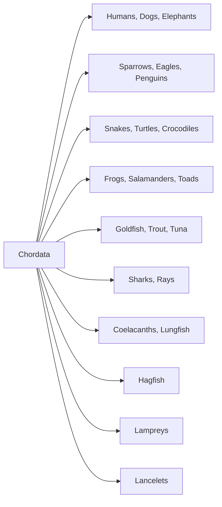
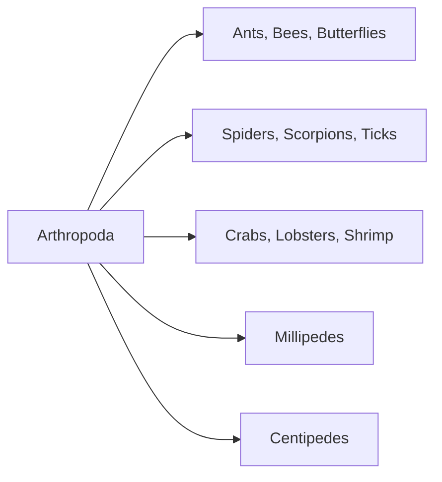
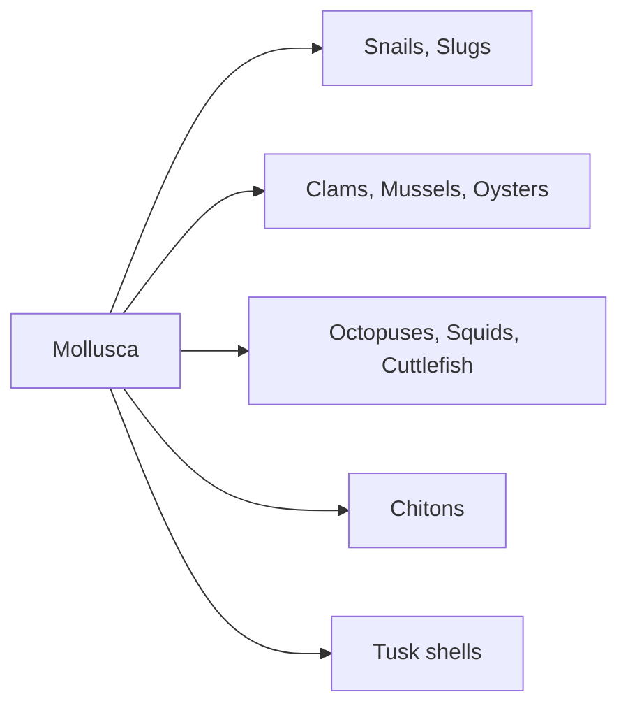
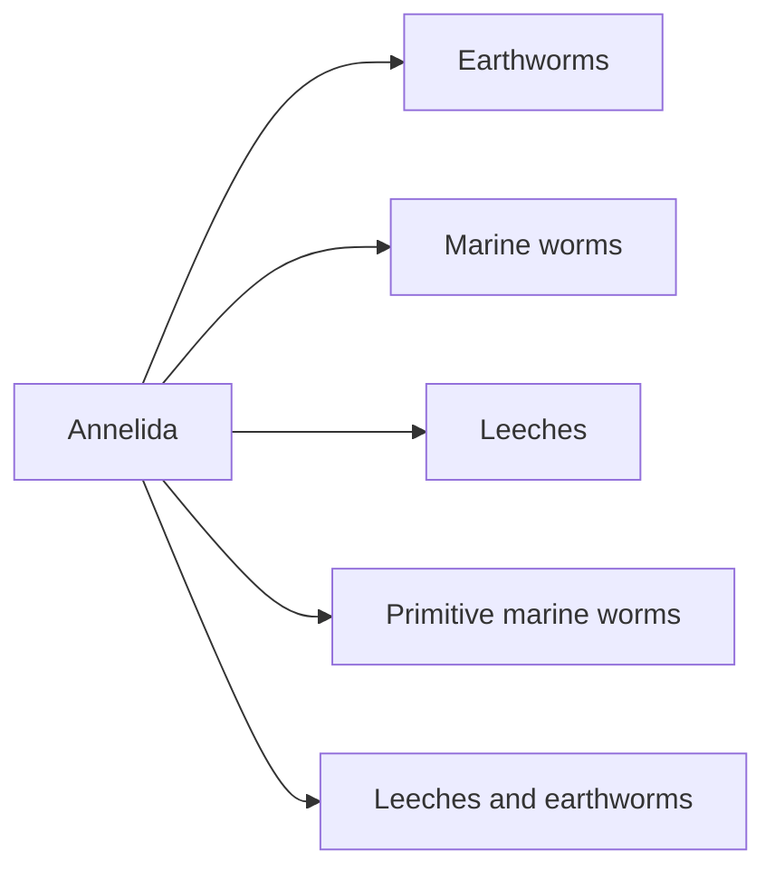
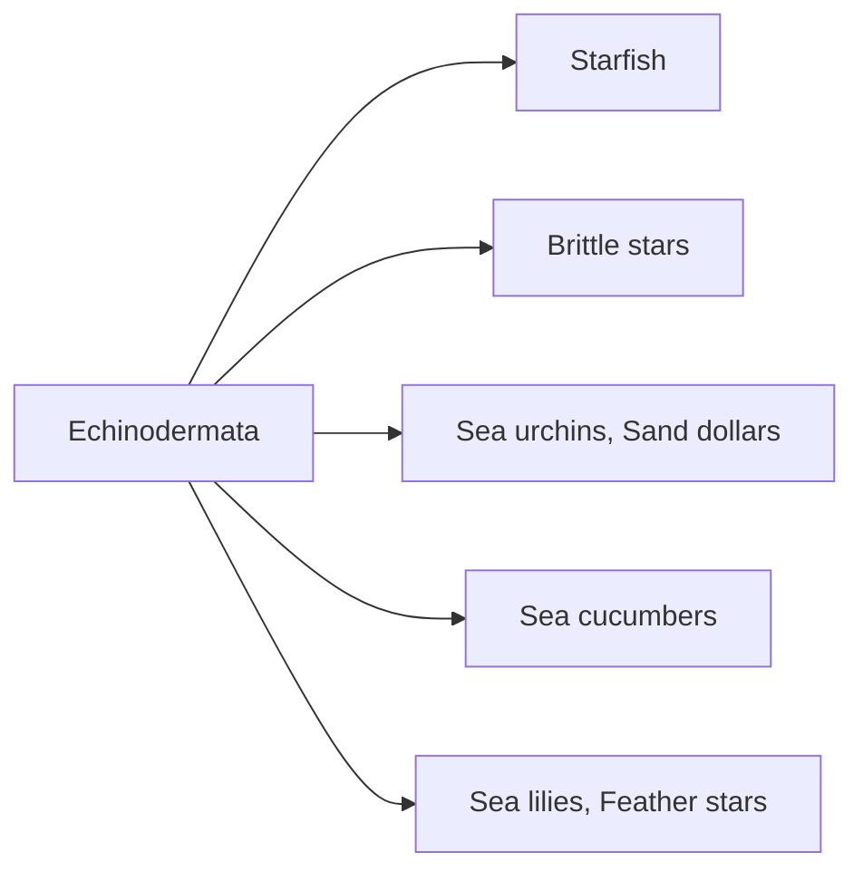

```mermaid
graph LR;
    Chordata --> Mammalia[Humans, Dogs, Elephants];
    Chordata --> Aves[Sparrows, Eagles, Penguins];
    Chordata --> Reptilia[Snakes, Turtles, Crocodiles];
    Chordata --> Amphibia[Frogs, Salamanders, Toads];
    Chordata --> Actinopterygii[Goldfish, Trout, Tuna];
    Chordata --> Chondrichthyes[Sharks, Rays];
    Chordata --> Sarcopterygii[Coelacanths, Lungfish];
    Chordata --> Myxini[Hagfish];
    Chordata --> Petromyzontida[Lampreys];
    Chordata --> Amphioxiformes[Lancelets];
```

```mermaid
graph LR;
    Arthropoda --> Insecta[Ants, Bees, Butterflies];
    Arthropoda --> Arachnida[Spiders, Scorpions, Ticks];
    Arthropoda --> Crustacea[Crabs, Lobsters, Shrimp];
    Arthropoda --> Diplopoda[Millipedes];
    Arthropoda --> Chilopoda[Centipedes];
```

```mermaid
graph LR;
    Mollusca --> Gastropoda[Snails, Slugs];
    Mollusca --> Bivalvia[Clams, Mussels, Oysters];
    Mollusca --> Cephalopoda[Octopuses, Squids, Cuttlefish];
    Mollusca --> Polyplacophora[Chitons];
    Mollusca --> Scaphopoda[Tusk shells];
```

```mermaid
graph LR;
    Annelida --> Oligochaeta[Earthworms];
    Annelida --> Polychaeta[Marine worms];
    Annelida --> Hirudinea[Leeches];
    Annelida --> Archiannelida[Primitive marine worms];
    Annelida --> Clitellata[Leeches and earthworms];
```

```mermaid
graph LR;
    Echinodermata --> Asteroidea[Starfish];
    Echinodermata --> Ophiuroidea[Brittle stars];
    Echinodermata --> Echinoidea[Sea urchins, Sand dollars];
    Echinodermata --> Holothuroidea[Sea cucumbers];
    Echinodermata --> Crinoidea[Sea lilies, Feather stars];
```